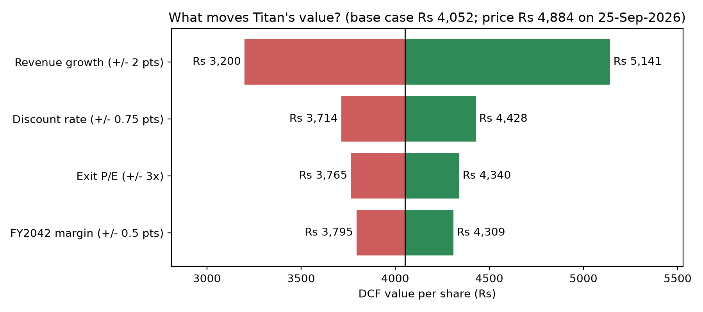
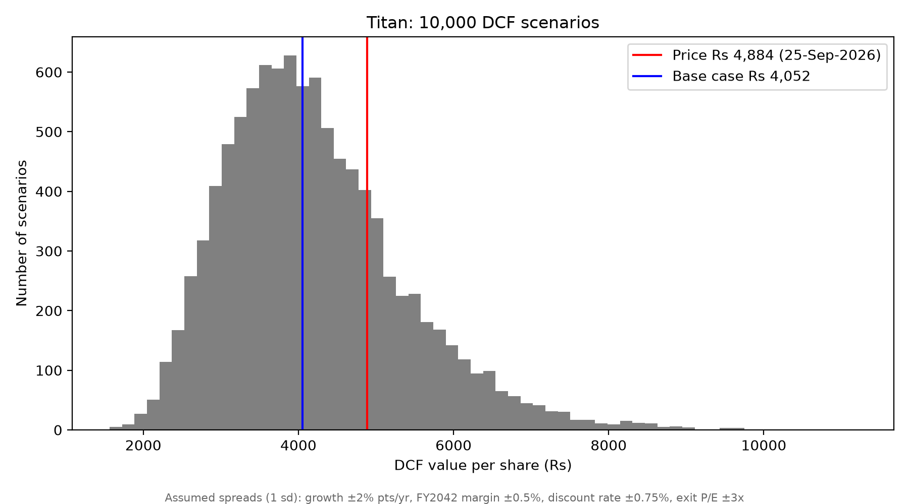

# Titan Company (NSE: TITAN): Equity Valuation & Risk Analysis

A valuation of Titan Company built in Excel and rebuilt in Python, with a 10,000-run Monte Carlo simulation, a sensitivity (tornado) chart and a reverse valuation of the growth the share price implies.

**Base case: ₹4,052 per share, 17% below the ₹4,884 NSE close on 25 September 2026.**

| | |
|---|---|
| Value per share (base case) | ₹4,052 |
| Share price (NSE close, 25-Sep-2026) | ₹4,884 |
| Upside / (downside) | (17.0%) |
| Revenue CAGR, FY2026–FY2042 | 12.6% |
| Constant revenue growth the price implies (16 years) | 14.6% |
| Terminal value as % of equity value | 62.7% |
| Monte Carlo median (10,000 runs) | ₹4,036 |
| Monte Carlo 90% range | ₹2,628 to ₹6,348 |
| Runs where value exceeds the price | 24% |





## Files

| File | What it is |
|---|---|
| `Titan_DCF_Model.xlsx` | Excel model: inputs in blue, forecast to FY2042, valuation, two sensitivity tables; sources and methodology on the Data sheet |
| `titan_dcf.py` | Python version: base case, Monte Carlo, implied growth and tornado chart |
| `Titan_Valuation_Note_Daksh_Chaudhary.pdf` | Two-page valuation note |
| `titan_monte_carlo.png`, `titan_tornado.png` | Charts produced by the script |

## Method

- **Cash flow to equity = net income.** Each year's net income is discounted at a 10.26% cost of equity. Terminal value is FY2042 net income × 26.5x P/E.
- **Revenue:** analyst estimates for FY2027–FY2029 (17.2%, 17.6%, 17.0%), then an S-curve fade to 6.95% by FY2042. The fade is my assumption and replaces the analysts' 7.2% FY2030 estimate.
- **Net margin:** S-curve fade from 6.71% to 6.63%.
- **Timing:** valued at the price date (25-Sep-2026). Only the remaining 51% of FY2027 is counted, and cash flows are discounted to each 31-March year-end.
- **Assumptions** follow Alpha Spread's TITAN DCF base case, except the growth fade from FY2030.
- **Monte Carlo:** revenue growth (±2 pts in every year), FY2042 margin (±0.5 pts), discount rate (±0.75 pts) and exit P/E (±3x) are drawn from normal distributions with these standard deviations. The spreads are my own assumptions, so the 24% figure depends on them.

## Run it

```bash
pip install -r requirements.txt
python titan_dcf.py
```

By default the script uses the 25-Sep-2026 close, so it reproduces the numbers above. Set `LIVE_PRICE = True` in the script to use the latest NSE close from Yahoo Finance instead (the price date must fall within FY2027).

## Limitations

- The model discounts net income, not free cash flow. Titan's jewellery business ties up a lot of cash in gold inventory, so free cash flow can be well below earnings; a free-cash-flow DCF is the natural next step.
- 62.7% of the value is terminal value, and the exit multiple (26.5x FY2042 earnings) is far below the ~86x the stock trades at on FY2026 earnings.
- Net cash and debt are not adjusted for.

## Sources

- Historical financials: company filings (consolidated) via Screener.in, retrieved 26-Sep-2026.
- Forecast assumptions to FY2029, cost of equity and exit multiple: Alpha Spread's TITAN DCF base case, retrieved 26-Sep-2026.
- Share price: Yahoo Finance (TITAN.NS), close of ₹4,884 on 25-Sep-2026.

*Student research for education only; not investment advice.*

Daksh Chaudhary · B.Sc. (Hons.) Computer Science, Keshav Mahavidyalaya, University of Delhi · [LinkedIn](https://www.linkedin.com/in/dakshchaudhary-finance)
