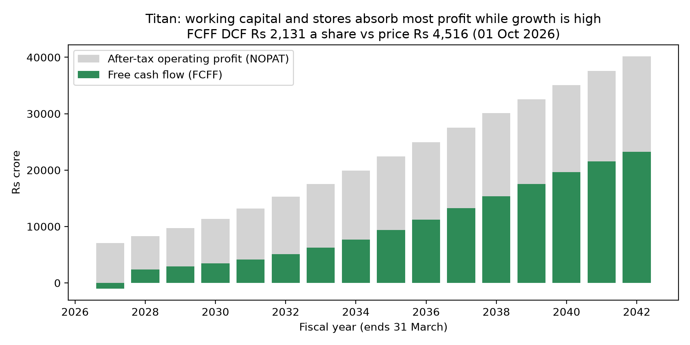

# Titan Company (NSE: TITAN): Equity Valuation & Risk Analysis

[](https://github.com/Dakshcore/titan-valuation/actions/workflows/tests.yml)

Two valuations of Titan Company, each built in Excel and in Python, both on the same revenue path and price date:

1. **Free cash flow (FCFF) DCF.** Values the cash left after Titan pays for new stores and the gold inventory that growth needs.
2. **Discounted-earnings model.** Discounts net income and exits at a P/E multiple. It comes with a 10,000-run Monte Carlo simulation, a tornado chart and a reverse valuation of the growth the price implies.

**At the ₹4,515.70 NSE close on 1 October 2026, the FCFF DCF gives ₹2,131 a share and the earnings model ₹4,058. Both are below the price.**

| | FCFF DCF | Discounted earnings |
|---|---:|---:|
| Value per share | **₹2,131** | **₹4,058** |
| vs price (₹4,515.70, 1-Oct-2026) | (52.8%) | (10.1%) |
| Discount rate | 10.08% WACC | 10.26% cost of equity |
| Terminal value | Gordon growth at 6.0% | 26.5x FY2042 earnings |
| Terminal value as % of value | 70.8% of EV | 62.7% of equity |
| What the price implies | 14.6% EBIT margin (vs 9.5% average), or 8.21% WACC | 14.0% revenue growth every year to FY2042 (vs 12.6% CAGR in the base case) |

The two values differ for two reasons, and both of them show up in the cash flows:

- **Reinvestment.** In the FCFF model, 42% of operating profit goes back into stores and working capital in FY2042. Gold inventory and other working capital alone run at about 24% of sales. The earnings model treats all net income as if it could be paid out.
- **Terminal value.** The Gordon terminal value is 10.5x FY2042 EBITDA, a much lower multiple than the earnings model's 26.5x exit P/E. Titan trades at about 79x FY2026 earnings today.

The market price makes sense only if Titan earns much higher margins or returns on new stores than its history shows, or keeps growing fast for longer than either model assumes.



## FCFF DCF

- **FCFF = EBIT × (1 − 25.17% tax) − (capex − D&A) − increase in working capital.** EBIT is profit before tax plus interest less other income.
- **Operating assumptions** are Titan's own history (consolidated, Screener.in):
  - EBIT margin 9.45%, the FY2022–FY2026 average.
  - Capex 2.48% and D&A 1.14% of sales, also FY2022–FY2026 averages.
  - Working capital 23.8% of sales, the FY2024–FY2026 average.
- **Gold on loan** (₹16,070 cr at FY2026) is gold Titan borrows from banks to hold as inventory and repays in gold.
  - **Base case:** treated as operating working capital, because Titan reports it separately from borrowings and ICICI Direct carries it as a current liability. I charge an assumed 2% yearly cost on it against EBIT, which takes 0.28 pts off the margin.
  - **As debt instead:** value falls to **₹1,639** (WACC 9.78%, working capital 37.7% of sales).
- **WACC 10.08%:**
  - Cost of equity 10.26%, the same as the earnings model.
  - Pre-tax cost of debt 6.84%: interest, less the gold-loan fee, over average borrowings excluding gold on loan.
  - Debt is 3.5% of capital at market value. Lease liabilities are included in debt.
- **Net debt** ₹12,634 cr = borrowings excluding gold on loan, less cash and bank balances.
- **Timing** is the same as the earnings model. Only the remaining 49.6% of FY2027 is counted, and cash flows are discounted to each 31-March year-end.

Value per share (₹), WACC down the side and terminal growth across the top:

| WACC | 5.0% | 5.5% | 6.0% | 6.5% | 7.0% |
|---|---:|---:|---:|---:|---:|
| 9.08% | 2,515 | 2,741 | 3,041 | 3,456 | 4,071 |
| 9.58% | 2,154 | 2,315 | 2,521 | 2,793 | 3,171 |
| **10.08%** | 1,868 | 1,985 | **2,131** | 2,318 | 2,566 |
| 10.58% | 1,635 | 1,723 | 1,829 | 1,962 | 2,132 |
| 11.08% | 1,443 | 1,509 | 1,589 | 1,686 | 1,807 |

## Discounted-earnings model

| | |
|---|---|
| Value per share (base case) | ₹4,058 |
| Revenue CAGR, FY2026–FY2042 | 12.6% |
| Monte Carlo median (10,000 runs) | ₹4,041 |
| Monte Carlo 90% range | ₹2,631 to ₹6,358 |
| Runs where value exceeds the price | 34% |


- **Cash flow to equity = net income.** Each year's net income is discounted at a 10.26% cost of equity. Terminal value is FY2042 net income × 26.5x P/E.
- **Revenue:** analyst estimates for FY2027–FY2029 (17.2%, 17.6%, 17.0%), then an S-curve fade to 6.95% by FY2042. The fade is my assumption; it replaces the analysts' 7.2% FY2030 estimate. The FCFF DCF uses the same path.
- **Net margin:** S-curve fade from 6.71% to 6.63%.
- **Assumptions** follow Alpha Spread's TITAN base case, except the growth fade from FY2030.
- **Monte Carlo:** four inputs are drawn from normal distributions with these standard deviations:
  - revenue growth, ±2 pts in every year;
  - FY2042 margin, ±0.5 pts;
  - discount rate, ±0.75 pts;
  - exit P/E, ±3x.

  The spreads are my own assumptions, so the 34% figure depends on them.

## Files

| File | What it is |
|---|---|
| `Titan_Valuation_Model.xlsx` | Excel model, inputs in blue. The **Valuation** sheet holds the discounted-earnings model with two sensitivity tables. The **FCFF DCF** sheet has history, WACC, forecast and a WACC × growth data table; a dropdown switches gold on loan between operating and debt. Sources are on the **Data** sheet. |
| `titan_fcff.py` | FCFF DCF in Python: base case, gold-on-loan-as-debt case, reverse DCF and sensitivity table |
| `titan_earnings.py` | Discounted-earnings model in Python: base case, Monte Carlo, implied growth and tornado chart |
| `tests/test_models.py` | 10 unit tests. They check both models' base values and that the FCFF terminal value matches a Gordon formula done by hand. They also check the reverse DCF reproduces the price and that values move the right way with each input. |
| `Titan_Valuation_Note_Daksh_Chaudhary.pdf` | Three-page valuation note: thesis, FCFF DCF, discounted-earnings cross-check |
| `titan_fcff.png`, `titan_monte_carlo.png`, `titan_tornado.png` | Charts produced by the scripts |

## Run it

```bash
pip install -r requirements.txt
python titan_fcff.py
python titan_earnings.py
python -m unittest -v
```

The scripts use the 1-Oct-2026 close, so they reproduce the numbers above, and the Excel sheets give the same values. To use the latest NSE close from Yahoo Finance instead, set `LIVE_PRICE = True` in `titan_earnings.py`; the price date must fall within FY2027.

## Limitations

- **Terminal value dominates both models:** 70.8% of FCFF enterprise value and 62.7% of earnings-model equity value.
- **Gold on loan:** its 2% cost is my assumption. Titan does not disclose the rate, and the treatment moves the FCFF value by about ₹500 a share.
- **Simple history inputs:**
  - Capex is derived from changes in net block and work in progress plus depreciation, so it includes new store leases.
  - Working capital comes from Screener's broad "other assets" and "other liabilities" lines.
- **Not adjusted for:**
  - investments other than cash and bank balances;
  - minority interests (for example, in Damas);
  - cash generated in FY2027 before the price date.

## Sources

- **Historical financials:** company filings (consolidated) via Screener.in, retrieved 1-Oct-2026.
- **Gold on loan:**
  - Consolidated: ICICI Direct's Q4FY26 result update.
  - Standalone (₹14,314 cr at FY2026): Titan's Q4FY26 results.
- **Earnings model, to FY2029:** forecast assumptions, cost of equity and exit multiple from Alpha Spread's TITAN base case, retrieved 26-Sep-2026.
- **Share price:** Yahoo Finance (TITAN.NS), close of ₹4,515.70 on 1-Oct-2026. The peer comps in [jewellery-peer-comps](https://github.com/Dakshcore/jewellery-peer-comps) use the same date.

MIT licence (see [LICENSE](LICENSE)). *Student research for education only; not investment advice.*

Daksh Chaudhary · B.Sc. (Hons.) Computer Science, Keshav Mahavidyalaya, University of Delhi · [LinkedIn](https://www.linkedin.com/in/dakshchaudhary-finance)
